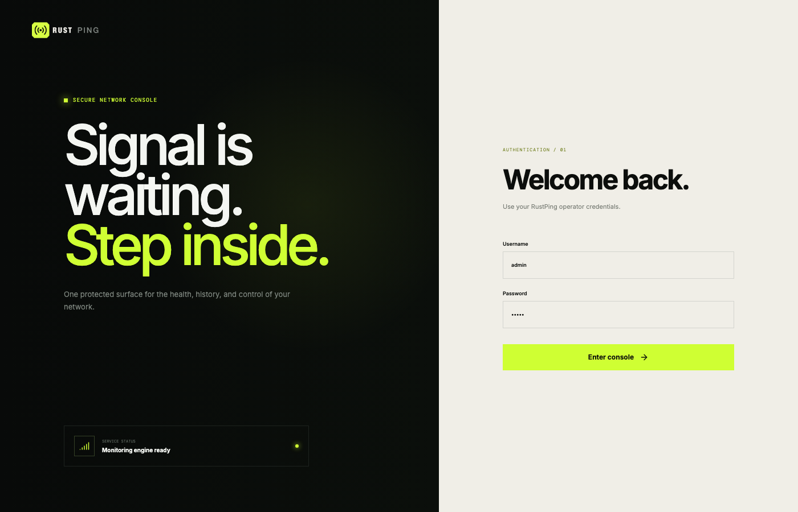
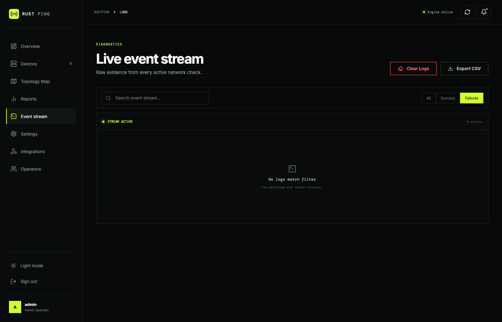
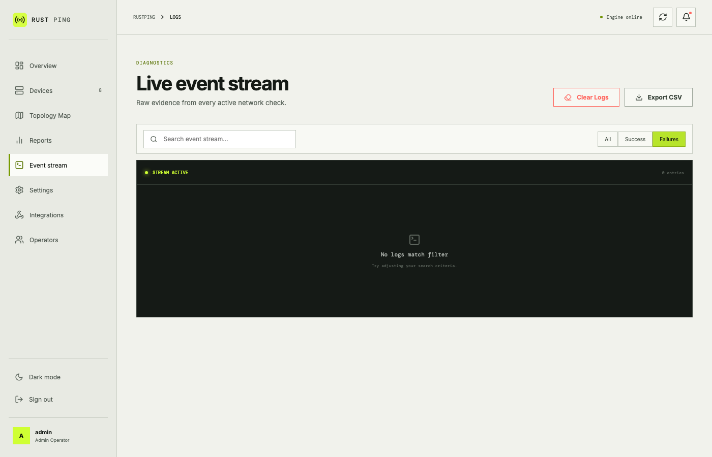

# 🚀 RustPing: Real-time Network Monitoring

RustPing 2.0 pairs its Rust monitoring engine with a professional Vue 3
operations console. The unified frontend includes authentication, a live
dashboard, device inventory, event stream, and alert configuration in one
responsive application.

[](https://www.rust-lang.org/)
[](https://rocket.rs/)
[](https://opensource.org/licenses/MIT)
[](https://github.com/karthik558/Rust-Ping/actions)


RustPing is a powerful, real-time network monitoring tool built with Rust and the Rocket web framework. It provides an interactive dashboard to monitor your network devices using Ping, HTTP checks, and bandwidth monitoring, all with a focus on speed, reliability, and ease of use.

## ✨ Features

*   **🔍 Real-time Device Monitoring:** Keep an eye on your network devices with live updates.
*   **📊 Interactive Dashboard:** Visualize your network's health with intuitive charts and tables.
*   **🌐 Multiple Sensors:**
    *   **Ping:** Check device availability.
    *   **HTTP:** Monitor website status and response times.
    *   **Bandwidth:** Track network usage.
*   **📝 Detailed Logging:**  Get comprehensive logs for troubleshooting and analysis.
*   **🔄 Automatic Retry:**  Handles intermittent network issues gracefully.
*   **📈 Visual Status Indicators:** Quickly identify problems with clear visual cues.
*   **🌙 / ☀️  Dark/Light Mode:** Choose the theme that suits your preference.
*   **📅 Log Export:** Export logs in CSV or TXT format for offline analysis.
*   **🔐 User Authentication:** Secure access with a login system (and planned role-based access).
*   **📱 Responsive Design:**  Works seamlessly on various devices, including desktops and tablets.
*   **🛠️ Device Dashboard** Users can add devices from front-end itself without editing the JSON.

## 🚧 Roadmap

These features are planned for future development:

*   **✅ Upcoming: User authentication and role-based access control:**  Control access and permissions.
*   **✅ Upcoming: Add device management features:**  Add, remove, and edit devices from the dashboard.
*   **🔴 Upcoming: New Sensors (TCP, UDP, etc.):**  Expand monitoring capabilities.
*   **🔴 Upcoming: Email/SMS Notifications:**  Get alerts for critical device status changes.
*   **🔴 Upcoming: Docker Support:** Simplify deployment and portability.
*   **🔴 Upcoming: Mobile App:** Monitor your network on the go.

## 📸 Screenshots

| Dark Mode                                  | Light Mode                                    |
| :----------------------------------------- | :-------------------------------------------- |
|           |      |
|               | |
|     |   |
|      |  |
|  |    |
|         |      |
|       |    |

## 📖 Table of Contents

*   [Prerequisites](#-prerequisites)
*   [Installation](#-installation)
    *   [Linux/MacOS](#installation-linuxmacos)
    *   [Windows](#installation-windows)
*   [Default Password](#-default-password-for-webui)
*   [Configuration](#-configuration)
*   [Usage](#-usage)
*   [Adding Devices](#-adding-devices)
*   [API Endpoints](#-api-endpoints)
*   [Contributing](#-contributing)
*   [License](#-license)

## ⚙️ Prerequisites

*   **Rust:**  1.56 or higher.  Install from [rustup.rs](https://rustup.rs/).
*   **Cargo:**  The Rust package manager (automatically installed with Rust).
*   **Network Access:**  RustPing needs network access to monitor your devices.

## 🛠️ Installation

### Installation (Linux/MacOS)

1.  **Clone the Repository:**

    ```bash
    git clone https://github.com/karthik558/Rust-Ping.git
    cd Rust-Ping
    ```

2.  **Install and build the Vue interface:**

    ```bash
    npm install
    npm run build
    ```

3.  **Build the Rust service (Release Mode):**

    ```bash
    cargo build --release
    ```
    This creates an optimized executable in the `target/release` directory.

4.  **Run the application:**

    ```bash
    ./target/release/Rust-Ping  # Run the compiled executable directly
    ```
     Alternatively use cargo:
    ```bash
     cargo run
    ```

5. **Access RustPing:** Open `http://127.0.0.1:8000/`.

### Installation (Windows)

1.  **Clone the Repository:**
    ```bash
    git clone https://github.com/karthik558/Rust-Ping.git
    cd Rust-Ping
    ```

2.  **Install MSYS2:**  Follow the instructions on the [MSYS2 website](https://www.msys2.org/) to install it.  This provides the necessary build tools.

3. **Rust Installation (if not already installed):** Follow the instructions on [Rust website](https://www.rust-lang.org/tools/install) to install Rust.

4. **Alternative MinGW Installation (if msys2 not working):** Download and install MinGW-w64 from [MinGW-w64 installer](https://github.com/Vuniverse0/mingwInstaller/releases/download/1.2.1/mingwInstaller.exe)

5. **Add MinGW to PATH:** Ensure the `bin` directory of your MinGW-w64 installation is added to your system's PATH environment variable. It should look similar to this: `C:\Program Files\mingw-w64\x86_64-8.1.0-posix-seh-rt_v6-rev0\mingw64\bin`

6.  **Set Rustup Default (Important!):**
   ```bash
   rustup default stable-x86_64-pc-windows-gnu
   ```
   Verify with:
   ```bash
   rustup show
   ```

7.  **Open a *New* Command Prompt:** Open a new command prompt or PowerShell window *after* installing MSYS2 and setting the Rustup default. This ensures the environment variables are loaded correctly. Navigate to project directory:
    ```bash
     cd Rust-Ping
    ```

8.  **Build the Project:**

    ```bash
    cargo build --release
    ```

9.  **Run the Application:**

    ```bash
     cargo run
    ```
    or (better for deployment):
    ```bash
    .\target\release\Rust-Ping.exe
    ```

10. **Access the Dashboard:** Open your web browser and navigate to `http://127.0.0.1:8000/`.  (Note the trailing `/` might be needed if you're directly running the executable).

## 🔑 Default Password for WebUI

*   **Username:** `admin`
*   **Password:** `admin`

**Important:** Change the default password immediately after your first login for security reasons!

## ⚙️ Configuration (Optional)

The `devices.json` file in the project's root directory controls which devices are monitored.  Edit this file to add, remove, or modify devices.  The file uses JSON format:

```json
[
  {
    "name": "Router",
    "ip": "192.168.1.1",
    "sensors": ["Ping", "Http"],
    "http_path": "http://192.168.1.1"
  },
  {
    "name": "NAS",
    "ip": "192.168.1.2",
    "sensors": ["Ping"]
  },
  {
    "name": "Example Website",
    "ip": "www.example.com",
    "sensors": ["Http"],
    "http_path": "https://www.example.com"
  }
]
```

*   **`name`:**  A descriptive name for the device.
*   **`ip`:** The IP address or hostname of the device.
*   **`sensors`:**  An array of sensors to use ("Ping", "Http", "Bandwidth").
*   **`http_path`:**  (Required for "Http" sensor) The full URL to check (e.g., `http://192.168.1.1` or `https://www.example.com`).

## 🚀 Usage

1.  **Access the Dashboard:** Open `http://127.0.0.1:8000/` (or `/static/index.html`) in your web browser.
2.  **Configure Devices:** Edit the `devices.json` file as described above.
3.  **Automatic Refresh:** The dashboard automatically refreshes every 5 seconds to display the latest device status.
4.  **View Details:** Click on entries in the tables to see more detailed information.
5. **Export Logs:** Use the log export form to generate CSV or TXT files of your monitoring data.

## 🖥️ Adding Devices
1.  **Access the Dashboard:** Open `http://127.0.0.1:8000/static/manage-devices.html` in your web browser.
2.  **Add Device:** Fill in the form with the device's name, IP address, Category, and sensors.  Click "Add Device" to save it to the `devices.json` file.
3. **View Devices:** After adding devices, you can view them listed on the dashboard. (Note: this will be updated in real-time without needing to refresh the page but wait for a few seconds for the changes to reflect).
4. **Edit Device:** Click on the device name to edit its details.  You can change the name, IP address, and sensors. (Note: Cant edit the category for now).
5. **Delete Device:** Click on the "Delete" button next to the device you want to remove.  Confirm the deletion in the popup dialog.

## 📡 API Endpoints

RustPing provides a REST API for interacting with the application programmatically.

| Method | Endpoint                     | Description                                      |
| :----- | :--------------------------- | :----------------------------------------------- |
| `GET`  | `/`                          | Serves the main dashboard HTML.                |
| `GET`  | `/static/index.html`          | Serves the main dashboard HTML.                |
| `GET`  | `/api/devices`               | Returns a JSON array of all monitored devices.   |
| `POST` | `/api/devices`               | Adds a new device to the `devices.json` file.   |
| `GET`  | `/export_log`              | Initiates a download of monitoring logs.      |
| `GET`  | `/log_json`                  | Returns logs in JSON format.                   |
| `GET`  | `/failed_log`                 | Returns logs for failed pings/HTTP checks.    |
| `POST`  | `/update-password`           | Updates the user's password.                   |
| `POST` | `/login` | For user login. |
| `GET`    | `/logout`                     | Logs the current user out.                      |
| `POST` | `/add_device`                | Adds a new device to the `devices.json` file.   |
| `POST` | `/delete_device`             | Deletes a device from the `devices.json` file.  |
| `POST` | `/update_device`             | Updates an existing device in the `devices.json` file. |

## 🤝 Contributing

Contributions are always welcome!  Here's how you can help:

1.  **Fork the Repository:** Create a copy of the repository on your GitHub account.
2.  **Create a Branch:**  Make your changes in a new branch: `git checkout -b my-feature-branch`
3.  **Make Changes:** Implement your feature or fix the bug.
4.  **Write Tests:**  Add tests to ensure your code works correctly and doesn't break existing functionality.
5.  **Commit Changes:**  `git commit -m "Add a descriptive commit message"`
6.  **Push to Your Fork:** `git push origin my-feature-branch`
7.  **Submit a Pull Request:**  Open a pull request from your branch to the main RustPing repository.

Please follow the [Rust style guidelines](https://doc.rust-lang.org/style-guide/).

## 📄 License

This project is licensed under the [MIT License](LICENSE).
