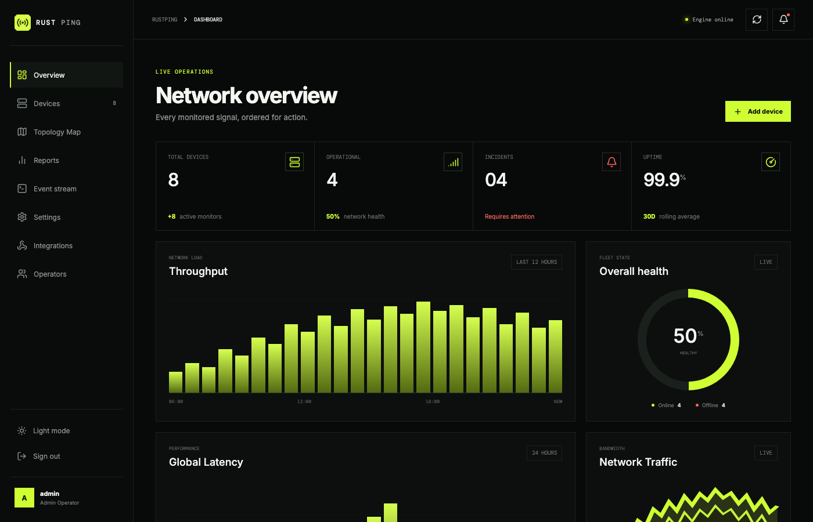
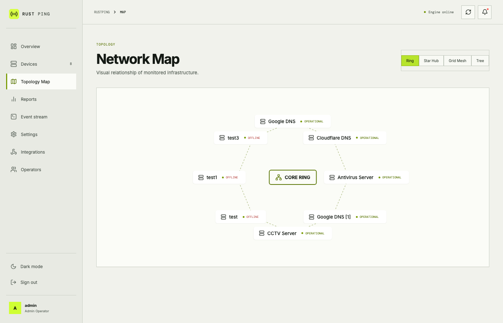
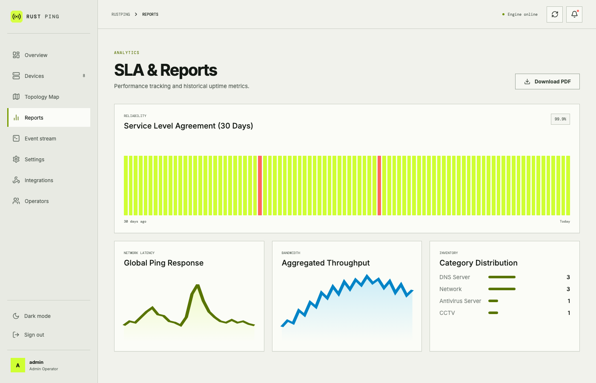
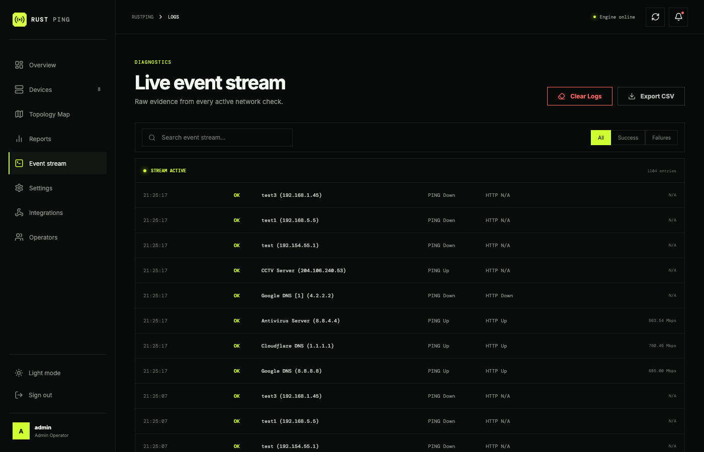

# RustPing — Enterprise Network & Infrastructure Monitoring Console

[](https://rustping.samsproject.in/)
[](https://www.rust-lang.org/)
[](https://rocket.rs/)
[](https://vuejs.org/)
[](https://www.sqlite.org/)
[](https://opensource.org/licenses/MIT)

**RustPing** is a self-hosted, enterprise-grade network device monitoring and operations console built with **Rust (Rocket)** and **Vue 3**. It provides real-time infrastructure tracking across 19 sensor types, visual network topology mapping, SLA analytics, SMTP alerting, role-based access control, status pages, and a live diagnostic event stream — all in a single responsive web application with no cloud dependency.

🌐 **Production Deployment:** [https://rustping.samsproject.in/](https://rustping.samsproject.in/)

---

## Screenshots

### Operations Dashboard
| Dark Mode | Light Mode |
| :---: | :---: |
|  |  |

### Network Topology Map
| Dark Mode | Light Mode |
| :---: | :---: |
|  |  |

### SLA & Analytics Reports
| Dark Mode | Light Mode |
| :---: | :---: |
|  |  |

### Device Inventory & Management
| Dark Mode | Light Mode |
| :---: | :---: |
|  |  |

### Diagnostic Event Stream
| Dark Mode | Light Mode |
| :---: | :---: |
|  |  |

### Authentication Console
| Dark Mode | Light Mode |
| :---: | :---: |
|  |  |

---

## Table of Contents

- [Key Features](#key-features)
- [Sensor Catalog](#sensor-catalog)
- [Prerequisites](#prerequisites)
- [Installation & Build Guide](#installation--build-guide)
- [Quick Start](#quick-start)
- [Default Login Credentials](#default-login-credentials)
- [Device Configuration](#device-configuration)
- [REST API Reference](#rest-api-reference)
- [Role-Based Access Control](#role-based-access-control)
- [Auto Network Discovery](#auto-network-discovery)
- [Host System Telemetry](#host-system-telemetry)
- [Status Pages](#status-pages)
- [Maintenance Windows](#maintenance-windows)
- [Alerting & Notifications](#alerting--notifications)
- [License](#license)

---

## Key Features

| Category | Features |
| :--- | :--- |
| **Monitoring Engine** | Multi-threaded async sensor loop via Tokio; 19 probe types; configurable poll interval (5s–1m) |
| **Network Sensors** | ICMP Ping (3-attempt majority vote), TCP Port, HTTP/HTTPS, DNS resolution latency |
| **Application Sensors** | SSL/TLS certificate expiry (real days remaining via OpenSSL), WebSocket handshake, HTTP TTFB |
| **Infrastructure Sensors** | SNMP Bandwidth (real OID poll), SSH, SMTP, NTP (real UDP exchange), FTP, Database ports |
| **Performance Sensors** | ICMP Jitter (real RTT std-deviation from 5 pings), Packet Loss (real 10-ping stats) |
| **System Sensors** | CPU Load & RAM (real OS metrics for localhost; SNMP for remote hosts), Disk Space |
| **Topology Engine** | Ring, Star Hub, Grid Mesh, Tree Hierarchy — interactive SVG canvas |
| **SLA Analytics** | 30-day uptime heatmap, ping latency trends, category breakdown, PDF export |
| **Auto Discovery** | Real subnet scanner (ICMP ping sweep + port detection across CIDR range) |
| **Host Telemetry** | Live hostname, OS name/version, CPU brand, RAM, disk, uptime, network interfaces |
| **Status Pages** | Public-facing hosted status pages per workspace with custom slugs |
| **Maintenance Windows** | Scheduled maintenance with alert suppression during windows |
| **RBAC** | Owner / Admin / Operator / Viewer roles with per-permission granularity |
| **Audit Log** | Full action trail for all user events, device changes, and admin actions |
| **Alerting** | SMTP email alerts on status change; alert suppression when parent device is down |
| **Themes** | Dark Mode / Light Mode with smooth toggle |
| **Mobile** | Fully responsive layout with collapsible sidebar for mobile/tablet |

---

## Sensor Catalog

RustPing supports **19 probe types** that can be combined per device:

| Sensor | Key | Protocol | What It Checks | Notes |
| :--- | :--- | :--- | :--- | :--- |
| ICMP Ping | `Ping` | ICMP | Host reachability (3-attempt majority vote) | Requires raw socket permissions on Linux |
| HTTP Check | `Http` | HTTP | Web service response code (2xx/3xx = UP) | Follows up to 10 redirects |
| HTTPS Check | `Https` | HTTPS | Secure web service response | TLS verified; accepts self-signed |
| TCP Port | `Port` | TCP | Arbitrary TCP port reachability | Specify port number in device config |
| SNMP Bandwidth | `Bandwidth` | SNMP UDP | `ifInOctets` delta → Mbps throughput | Requires SNMPv2c agent; community string per device |
| SSL Certificate | `SslCert` | TLS | Real certificate expiry date (days remaining) | Uses `openssl s_client`; warns at < 14 days |
| DNS Resolution | `Dns` | UDP 53 | Hostname resolution latency + resolved IP | Reports resolved IP and round-trip time |
| Database | `Database` | TCP | Port reachability for Postgres/MySQL/Redis/MongoDB | Auto-names by port number |
| SSH | `Ssh` | TCP 22 | SSH daemon port availability | Configurable port |
| SMTP | `Smtp` | TCP 25/587 | Mail server port availability | Configurable port |
| NTP | `Ntp` | **UDP 123** | Real NTP packet exchange + sync status | Validates server synchronization flag |
| FTP | `Ftp` | TCP 21 | FTP server banner availability | Configurable port |
| Jitter | `Jitter` | ICMP | RTT standard deviation from 5 pings (ms) | Uses ping mdev field |
| HTTP Latency | `HttpLatency` | HTTP | Time-to-first-byte (TTFB) in ms | Reports HTTP status code |
| Packet Loss | `PacketLoss` | ICMP | Real % packet loss from 10-ping test | Reports exact percentage |
| CPU Load | `CpuLoad` | OS / SNMP | CPU % + RAM % utilization | Localhost: reads OS; Remote: SNMP OID or "Agent Required" |
| Disk Space | `DiskSpace` | OS / SNMP | Free disk percentage + available space | Localhost: reads `df`; Remote: SNMP OID or "Agent Required" |
| WebSocket | `WebSocket` | TCP + HTTP | Real HTTP 101 Upgrade handshake | Verifies "Switching Protocols" response |
| SNMP | `Snmp` | SNMP UDP | General SNMP device availability | Community string per device |

> [!NOTE]
> **Remote CPU/Disk sensors** require either (a) an SNMP agent (e.g., `snmpd`) running on the target host with community `public`, or (b) a future SSH-based agent. For the monitoring host itself (`127.0.0.1` / `localhost`), real OS metrics are always available.

> [!NOTE]
> **SNMP Bandwidth** requires the target device to have SNMPv2c enabled. The default community string is `public`; set a custom string per device in the Add Device modal.

---

## Prerequisites

| Requirement | Version | Purpose |
| :--- | :--- | :--- |
| **Rust** | 1.70+ | Build backend binary |
| **Node.js** | 18+ | Build Vue 3 frontend |
| **npm** | 9+ | Package management |
| **OpenSSL CLI** | Any | Real SSL cert expiry checks (`openssl s_client`) |
| **ping** | System | ICMP ping, jitter, packet loss probes |
| **snmpget** | Optional | Remote CPU/Disk SNMP probes (`brew install net-snmp` / `apt install snmp`) |
| **osx-cpu-temp** | Optional (macOS) | Host thermal sensor (`brew install osx-cpu-temp`) |

**Linux only:** ICMP ping requires raw socket permissions:
```bash
sudo setcap cap_net_raw=+ep ./target/release/RustPing
```

---

## Installation & Build Guide

### Linux (Ubuntu / Debian / RHEL)

```bash
# 1. Clone the repository
git clone https://github.com/karthik558/Rust-Ping.git
cd Rust-Ping

# 2. Install Node.js dependencies and build the Vue 3 frontend
npm install
npm run build

# 3. Build the Rust backend release binary
cargo build --release

# 4. Grant ICMP raw socket permissions (required for ping probes)
sudo setcap cap_net_raw=+ep ./target/release/RustPing

# 5. (Optional) Install SNMP tools for remote CPU/Disk probes
sudo apt install snmp

# 6. Start RustPing
./target/release/RustPing
```

### macOS (Apple Silicon & Intel)

```bash
# 1. Clone the repository
git clone https://github.com/karthik558/Rust-Ping.git
cd Rust-Ping

# 2. Build frontend assets
npm install
npm run build

# 3. (Optional) Install tools for enhanced telemetry
brew install osx-cpu-temp   # Host CPU temperature sensor
brew install net-snmp       # snmpget for remote SNMP probes

# 4. Build and run
cargo run --release
```

### Windows 10 / 11

1. Install **Rust** via [rustup.rs](https://rustup.rs/) (`x86_64-pc-windows-msvc` toolchain).
2. Install **Node.js** from [nodejs.org](https://nodejs.org/).

```powershell
git clone https://github.com/karthik558/Rust-Ping.git
cd Rust-Ping
npm install
npm run build
cargo build --release
.\target\release\RustPing.exe
```

> [!NOTE]
> On Windows, run the executable as Administrator for ICMP ping to work correctly.

---

## Quick Start

1. Start RustPing: `./target/release/RustPing` (or `cargo run` for development)
2. Open a browser and navigate to:
   ```
   http://127.0.0.1:8000/
   ```
3. Log in with the default credentials, then add your first device using **+ Add Device**.

---

## Default Login Credentials

| Field | Value |
| :--- | :--- |
| **Username** | `admin` |
| **Password** | `admin` |

> [!IMPORTANT]
> Change the default password immediately after first login under **Settings → Operators → Change Password**.

---

## Device Configuration

Devices are managed via the Web UI or by editing `devices.json` at the project root:

```json
[
  {
    "name": "Core Router",
    "ip": "192.168.1.1",
    "category": "Network",
    "sensors": ["Ping", "Http", "Dns"],
    "http_path": "http://192.168.1.1",
    "parent_device": null
  },
  {
    "name": "Web Server",
    "ip": "192.168.1.50",
    "category": "Services",
    "sensors": ["Ping", "Https", "SslCert", "HttpLatency"],
    "http_path": "https://myapp.example.com",
    "parent_device": "Core Router"
  },
  {
    "name": "Database",
    "ip": "192.168.1.100",
    "category": "Database",
    "sensors": ["Ping", "Database", "DiskSpace"],
    "port": 5432,
    "parent_device": "Core Router"
  },
  {
    "name": "NAS Storage",
    "ip": "192.168.1.200",
    "category": "Storage",
    "sensors": ["Ping", "Ssh", "DiskSpace"],
    "snmp_community": "public"
  }
]
```

### Device Fields

| Field | Required | Description |
| :--- | :--- | :--- |
| `name` | ✅ | Display name in the console |
| `ip` | ✅ | IP address or hostname |
| `category` | ✅ | Grouping label (any string) |
| `sensors` | ✅ | Array of sensor keys from the sensor catalog |
| `http_path` | For Http/Https/SslCert | Full URL to probe |
| `port` | For Port/Database sensors | TCP port number |
| `snmp_community` | For Snmp/Bandwidth | SNMPv2c community string (default: `public`) |
| `parent_device` | Optional | Name of parent device; suppresses child alerts when parent is down |

---

## REST API Reference

All API endpoints require authentication (session cookie) except `/login` and `/status/<slug>`.

### Device Management

| Method | Endpoint | Description |
| :--- | :--- | :--- |
| `GET` | `/devices` | List all monitored devices with current status |
| `POST` | `/devices` | Add a new device to the monitoring inventory |
| `PUT` | `/devices/<index>` | Update a device's configuration |
| `DELETE` | `/devices/<index>` | Remove a device from monitoring |

### Log & Event Management

| Method | Endpoint | Description |
| :--- | :--- | :--- |
| `GET` | `/logs_json` | Retrieve recent monitoring log entries as JSON |
| `DELETE` | `/logs` | Clear all historical event logs (Admin only) |
| `GET` | `/export_log` | Export filtered logs as CSV or plaintext |

### Email & Alerts

| Method | Endpoint | Description |
| :--- | :--- | :--- |
| `GET` | `/email/config` | Get current SMTP alert configuration |
| `POST` | `/email/config` | Save SMTP server credentials and recipients |
| `POST` | `/email/test` | Send a test alert email |

### User Management

| Method | Endpoint | Description |
| :--- | :--- | :--- |
| `POST` | `/login` | Authenticate and create session |
| `GET` | `/users` | List all operator accounts |
| `POST` | `/users` | Create a new operator account |
| `DELETE` | `/users/<id>` | Remove an operator account |
| `POST` | `/change_password` | Change current user's password |

### Settings

| Method | Endpoint | Description |
| :--- | :--- | :--- |
| `GET` | `/settings` | Retrieve global site settings |
| `POST` | `/settings` | Save site settings (theme, poll interval, etc.) |
| `GET` | `/audit_logs` | Retrieve system audit trail |

### Status Pages

| Method | Endpoint | Description |
| :--- | :--- | :--- |
| `GET` | `/status_pages` | List all configured status pages |
| `POST` | `/status_pages` | Create a new public status page |
| `GET` | `/status/<slug>` | Render a public status page (no auth required) |

### Maintenance Windows

| Method | Endpoint | Description |
| :--- | :--- | :--- |
| `GET` | `/maintenance` | List all scheduled maintenance windows |
| `POST` | `/maintenance` | Create a new maintenance window |

### System Telemetry & Discovery

| Method | Endpoint | Description |
| :--- | :--- | :--- |
| `GET` | `/system_info` | Real-time host OS, CPU, RAM, disk, and network info |
| `GET` | `/scan_network?subnet=<CIDR>` | Scan a subnet CIDR and return live hosts with open ports |

---

## Role-Based Access Control

| Role | Manage Devices | View Logs | Change Settings | Manage Users |
| :--- | :---: | :---: | :---: | :---: |
| **Owner** | ✅ | ✅ | ✅ | ✅ |
| **Admin** | ✅ | ✅ | ✅ | ✅ |
| **Operator** | ✅ | ✅ | ✅ | ❌ |
| **Viewer** | ❌ | ✅ | ❌ | ❌ |

Manage users under **Settings → Operators**.

---

## Auto Network Discovery

Navigate to **Auto Discovery** in the sidebar to scan your local subnet for live hosts:

1. Enter a CIDR range (e.g., `192.168.1.0/24`) or leave blank to auto-detect.
2. Click **Scan Subnet** — RustPing concurrently pings up to 30 IPs and checks common service ports (80, 443, 22, 3306, 5432, 27017).
3. Click **+ Import** next to any discovered host to pre-fill the Add Device form.

---

## Host System Telemetry

Navigate to **Host System** to view real-time metrics for the machine running RustPing:

| Metric | Data Source |
| :--- | :--- |
| Hostname | `hostname` command |
| OS Name & Version | `sw_vers` (macOS) / `/etc/os-release` (Linux) |
| CPU Brand & Cores | `sysctl machdep.cpu.brand_string` / `/proc/cpuinfo` |
| CPU Load % | `top -l 1` (macOS) / `/proc/stat` (Linux) |
| RAM Used / Total | `vm_stat` (macOS) / `free` (Linux) |
| CPU Temperature | `osx-cpu-temp` (macOS, optional) / `/sys/class/thermal` (Linux) |
| Disk Partitions | `df -H` |
| Network Interfaces | `ifconfig` (macOS) / `ip addr` (Linux) |
| System Uptime | `uptime` |

> [!TIP]
> Install `osx-cpu-temp` on macOS for real thermal readings: `brew install osx-cpu-temp`

---

## Status Pages

Create public-facing status pages for your services under **Settings → Status Pages**:

- Each page has a unique **slug** (e.g., `/status/my-service`)
- Accessible without authentication at `http://your-server:8000/status/<slug>`
- Shows a summary of selected device health states

---

## Maintenance Windows

Schedule planned maintenance windows under **Settings → Maintenance**:

- Set a title, start time, and end time
- Enable **Suppress Alerts** to mute email notifications during the window
- Maintenance windows are visible in the console for all operators

---

## Alerting & Notifications

RustPing sends SMTP email alerts when a device's status changes to DOWN.

### Configuration

1. Go to **Settings → Email Alerts**
2. Enter your SMTP server details:
   - **SMTP Server** (e.g., `smtp.gmail.com`)
   - **Port** (587 for TLS, 465 for SSL)
   - **Username / Password**
   - **From Address** and **Alert Recipients**
3. Click **Save**, then **Send Test Email** to verify

> [!IMPORTANT]
> For Gmail: use an **App Password** (not your regular password). Enable 2FA on your Google account, then generate an App Password under Security → App Passwords.

> [!NOTE]
> Alerts are suppressed for child devices when their configured `parent_device` is already DOWN — preventing alert storms during upstream outages.

---

## Visual Network Topology

Navigate to **Network Map** to view your infrastructure relationships:

| View | Layout |
| :--- | :--- |
| **Ring** | Circular loop — nodes linked to adjacent neighbours |
| **Star Hub** | Radial spokes — all nodes connected to a central hub |
| **Grid Mesh** | Matrix — each node connected to neighbours in a grid |
| **Tree** | Hierarchical parent–child dependency tree |

---

## Architecture Overview

```
┌─────────────────────────────────────────────────────────────────┐
│                         RustPing Server                          │
│                                                                  │
│  ┌──────────────┐   ┌──────────────┐   ┌────────────────────┐  │
│  │  Rocket Web  │   │ Monitor Loop │   │  SQLite (rusqlite) │  │
│  │   (Async)    │   │  (Tokio      │   │  Devices · Logs    │  │
│  │  REST API    │   │   Spawned)   │   │  Users · Settings  │  │
│  └──────┬───────┘   └──────┬───────┘   └────────────────────┘  │
│         │                  │                                     │
│         │    19 Sensors     │                                     │
│         │  ┌────────────────┴─────────────────────────────────┐  │
│         │  │ Ping · HTTP/S · TCP · DNS · SSL · Jitter · NTP   │  │
│         │  │ SNMP · SSH · SMTP · FTP · DB · WS · Loss · etc.  │  │
│         │  └──────────────────────────────────────────────────┘  │
└─────────┼───────────────────────────────────────────────────────┘
          │
          ▼ HTTP (port 8000)
┌─────────────────────┐
│   Vue 3 SPA         │
│  (Vite bundled)     │
│  Dashboard · Topo   │
│  Reports · Logs     │
│  Discovery · Host   │
└─────────────────────┘
```

---

## License

Distributed under the **MIT License**. See [`LICENSE.md`](LICENSE.md) for details.

Maintained by the RustPing Project | [https://rustping.samsproject.in/](https://rustping.samsproject.in/)
